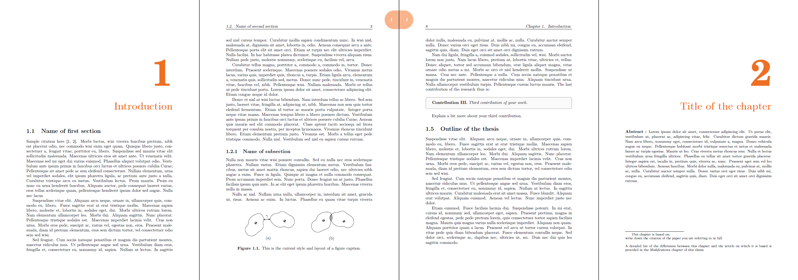

# PhD Thesis Template
Original template created by Bart Besselink, Benjamin Biemond, and Mark Rijnen and further cleaned up and made available by Brandon Caasenbrood and Maarten Jongeneel. 

# Template
The figure below shows a screenshot of some of the pages to give an impression of what the thesis looks like.

# Usage in overleaf
